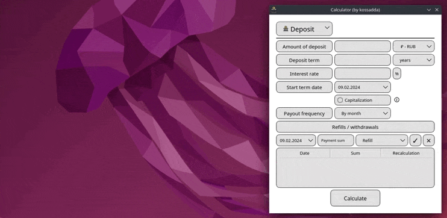

# SmartCalc v1.0

Implementation SmartCalc v1.0.

The Russian version of the README can be found in the repository.

## Contents
1. [Appearance](#appearance)
2. [Project description](#project-description)
3. [Development team](#development-team)
4. [Building project](#building-project)
5. [Testing](#testing)
6. [Detailed implementation description](#detailed-implementation-description)
7. [Feedback](#feedback)

 

## Appearance

**Engineering calculator:**  

  

**Credit calculator:**  

  

**Deposit calculator:**  

  

## Project description 

The goal of this project is to implement in the C programming language, using a structured approach, an extended version of the common calculator that can be found in standard applications of every operating system. In addition to basic arithmetic operations, such as plus/minus and multiply/divide, the calculator is complemented by the ability to calculate arithmetic expressions taking into account priorities, as well as some mathematical functions (sine, cosine, logarithm, etc.). In addition to evaluating expressions, the calculator also supports using the variable x and plotting the corresponding function. As additional improvements, loan and deposit calculators have been implemented.

### Engineering calculator

- The program was developed in the C language standard C11 using the gcc compiler, additional libraries and QT modules;
- The program code is located in the src folder;
- The program build is configured using a Makefile with a standard set of targets for GNU programs: all, install, uninstall, clean, dvi, dist, test, gcov_report. Installation is carried out in the bin directory;
- The program is developed in accordance with the principles of structured programming;
- Code formatting is made in accordance with Google Style;
- Provided unit test coverage for modules related to expression evaluation using the Check library;
- GUI implementation based on QT GUI libraries with API for C11;
- Both integers and real numbers written through a dot are supplied to the program input. Processed input of numbers in exponential notation;
- The calculation is performed after completely entering the calculated expression and clicking on the `=` symbol;
- Evaluation of arbitrary parenthetical arithmetic expressions in infix notation;
- Calculation of arbitrary parenthetical arithmetic expressions in infix notation with substitution of the value of the variable `x` as a number;
- Plotting a graph of a function specified using an expression in infix notation with a variable `x` (with coordinate axes, a mark of the scale used and a grid with an adaptive step);
     - Allowing the user to change the scale;
- The scope and scope of functions are limited to at least the numbers from `-1000000` to `1000000`;
     - To plot function graphs, you must additionally specify the displayed domain of definition and domain of value;
- Verified accuracy of the fractional part - 7 decimal places;
- The user has the ability to enter up to 255 characters;
- Bracket arithmetic expressions in infix notation support the following arithmetic operations and mathematical functions:

**Arithmetic operators**:

| Operator name  | Infix notation   (Classic) | Prefix notation   (Polish notation) |  Postfix notation   (Reverse Polish notation) |
| -------------- | ------------------------------- | ---------------------------------------- | -------------------------------------------------- |
| Brackets       | (a + b)                         | (+ a b)                                  | a b +                                              |
| Addition       | a + b                           | + a b                                    | a b +                                              |
| Subtraction    | a - b                           | - a b                                    | a b -                                              |
| Multiplication | a * b                           | * a b                                    | a b *                                              |
| Division       | a / b                           | / a b                                    | a b \                                              |
| Power          | a ^ b                           | ^ a b                                    | a b ^                                              |
| Modulus        | a mod b                         | mod a b                                  | a b mod                                            |
| Unary plus     | +a                              | +a                                       | a+                                                 |
| Unary minus    | -a                              | -a                                       | a-                                                 |

> An expression with the `*` sign omitted has been processed.

**Функции**:

| Function description        | Function |   
| ----------------------------| -------- |  
| Computes cosine             | cos(x)   |   
| Computes sine               | sin(x)   |  
| Computes tangent            | tan(x)   |  
| Computes arc cosine         | acos(x)  | 
| Computes arc sine           | asin(x)  | 
| Computes arc tangent        | atan(x)  |
| Computes square root        | sqrt(x)  |
| Computes natural logarithm  | ln(x)    | 
| Computes common logarithm   | log(x)   |

### Credit calculator

There is a special mode “advanced loan calculator”:
  - Input: total loan amount, term, interest rate, loan date, type (annuity, differentiated), early repayment (reduced term, reduced payments)
  - Output: monthly payment, loan overpayment, total payment, monthly report

### Deposit calculator

There is a special mode “deposit return calculator”:
  - Input: deposit amount, placement period, interest rate, deposit date, payment frequency, interest capitalization, operations (replenishment, partial withdrawals)
  - Output: accrued interest, tax amount, amount on deposit by the end of the term, monthly report

## Development team

Composition of the team that implemented the project:  
**kossadda** (https://github.com/kossadda)  

## Building project

The following main targets for working with the project have been added to the Makefile:

| #  | Target             | Target description                                                        |
|----| ------------------ | ------------------------------------------------------------------------- |
| 1  | `all`              | Builds the project and generates project documentation.                   |
| 2  | `install`          | Builds the project.                                                       |
| 3  | `uninstall`        | Uninstalls the project.                                                   |
| 4  | `smartcalc`        | Builds modules into a static library.                                     |
| 5  | `test`             | Performs module testing.                                                  |
| 6  | `gcov_report`      | Tests modules and generates a coverage report in html format.             |
| 7  | `dvi`              | Generates documentation in html and manual format for the functionality.  |
| 8  | `dist`             | Compresses the project into a tar archive.                                |
| 9  | `clean`            | Cleans the repository of generated files.                                 |
| 10 | `rebuild`          | Rebuilds the project.                                                     |
| 11 | `clang_check`      | Testing modules for compliance with Google style.                         |
| 12 | `cppcheck`         | Testing modules using the cppcheck code analyzer.                         |
| 13 | `valgrind`         | Testing modules for working with memory using Valgrind.                   |
| 14 | `qmake_build`      | Builds the project using qmake.                                           |
| 15 | `docker_build`     | Builds the project using Docker.                                          |
| 16 | `dependencies`     | Installs the necessary dependencies for building and testing the project. |

 

The project can be built using the main target `install`, which builds the project using cmake. There is a variation of installation using qmake via the `qmake_build` target, as well as using docker via the `docker_build` target.

> To build the project on any operating system, you need cmake and qtbase starting from version 5.15.

## Testing

The written code was tested by unit-tests using the check library. 

  

The code was covered with tests and output to an html report using gcovr. 

  

Code tested for errors/leaks via valgrind.  

  

## Detailed implementation description

In the calculator in the upper left corner there is a switch with a drop-down list containing engineering, loan and deposit calculators.

### Engineering calculator: key features

Has three operating modes:

- Standard mode for calculating mathematical expressions.
- Mode for calculating mathematical expressions that include the variable x.
- Mode for plotting a graph using a mathematical expression.

1. For the most part, the reconciliation of calculations and some elements of the calculator was carried out based on the calculator from the site `web2.0calc.com`. Some points were gleaned from Google and Windows calculators.
2. Keyboard input is supported (all numbers/operations and only those letters that are available in functions supported by the calculator). Basic keys:
- `enter` or `=` - calculation of a mathematical expression;
- `backspace` - remove the last character;
- `esc` - clear the input field and history;
- `e` - Euler number/scientific notation for writing a number;
- `p` - Pi number;
- `x` - variable x;
- `z` - return the previous calculated mathematical expression;
- `x` - return the next calculated mathematical expression;
- `v` - switch to the mode of calculating a mathematical expression with variable x;
- `b` - switch to the mode of plotting a graph using a mathematical expression.
3. Interactive input validation occurs, which will tell you whether the mathematical expression is entered correctly;
4. By expanding the window horizontally, you can access the input history view;
5. Entering trigonometric and logarithmic functions is carried out exclusively through the opening bracket after them;
6. The calculator fully supports writing functions/numbers/brackets together, simulating multiplication between them. For example, `5log(2)` is an acceptable spelling;
7. Writing scientific number notation and using Euler's number are supported. That is, `5e-2` will be counted as `0.05`, and `5e*2` will be `5*(Euler number)*2`;
8. In variable input mode, a value entry field `x` appears, which is also interactively validated;
9. In variable input mode, the expression will not be calculated if an incorrect value `x` is entered;
10. In plotting mode, the minimum acceptable range between the minimum and maximum `x` or `y` is 4;
11. The input of the domain of definition and acceptable values of the function is interactively validated. The definition areas are limited to a range of `{1000000:-1000000}`;
12. You can enter the required graph step to build more accurate graphs. The range of the permissible step varies in the range `{0.001:100}` (it should also be noted that with a large range of permissible values, that is, the range `x` - the smaller the step, the longer the construction takes);
13. The graph can be zoomed and interactively moved along the coordinate plane;
14. When you click on the `Tracing` button, the ability to interactively move along the coordinate plane is replaced by moving the tracing rays along the current graph. Tracing rays allow you to track the dynamics of changes in `f(x)` in any range of `x`. To track changes, two small windows appear on the right side, displaying the values of `x` and `y` at a certain point in the graph;
15. When the graphing and expression calculation modes with the `x` variable are enabled simultaneously, execution priority is given to graphing.

### Credit calculator: key features

1. The advanced loan calculator from the website `calcus.ru` was taken as a basis;
2. All user input fields are interactively validated;
3. The loan amount varies in the range `{0.01:999999999999.99}`;
4. The loan term varies in the range of `{1:600}` - months, `{1:50}` - years;
5. The interest rate varies in the range `{0.001:999}`;
6. The possibility of carrying out early repayment transactions is available;
7. The field for entering the amount of early repayments has the same range as the loan amount;
8. When you click on the `Calculate` button, a full loan report is generated, containing information about each month of the loan and general indicators for the amounts paid.

### Deposit calculator: key features

1. The deposit calculator from the site `calcus.ru` was taken as a basis;
2. All user input fields are interactively validated;
3. The loan amount varies in the range `{0.01:999999999999.99}`;
4. The loan term varies in the range `1:18250` - days, `{1:600}` - months, `{1:50}` - years;
5. The interest rate varies in the range `{0.001:999}`;
6. It is possible to carry out replenishment operations and partial withdrawals of funds from the deposit;
7. The field for entering the amount of deposits/withdrawals has the same range as the deposit amount.
8. Various variations of account capitalization periods are available.
9. When you click on the `Calculate` button, a full deposit report is generated, containing information about each period of account capitalization, general indicators for paid amounts and tax amounts.

## Feedback

If you have any questions regarding the features or other aspects of the project that interest you, please contact us by email:

gabilov1997@gmail.com  

Thank you for your attention. I hope you enjoy this project and find it useful.

 

[Return to contents](#smartcalc-v10)