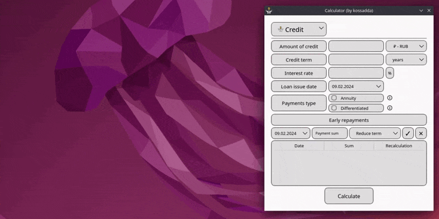
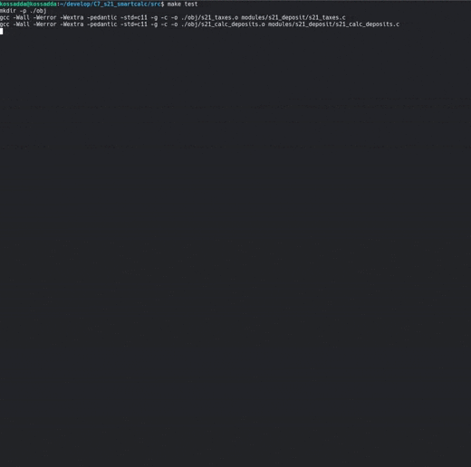
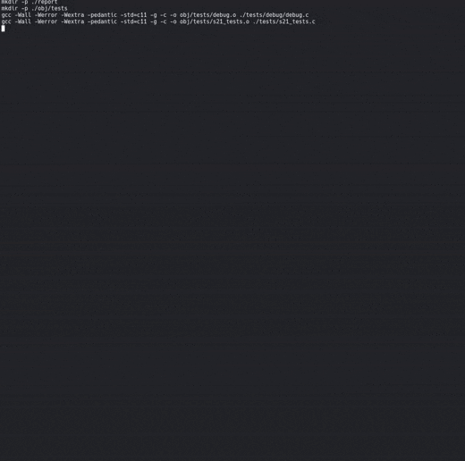

# SmartCalc v1.0

Реализация SmartCalc v1.0.

Английскую версию README можно найти в репозитории. 

## Содержание
1. [Внешний вид](#внешний-вид)
2. [Описание проекта](#описание-проекта)
3. [Команда разработки](#команда-разработки)
4. [Сборка проекта](#сборка-проекта)
5. [Тестирование](#тестирование)
6. [Подробное описание реализации](#подробное-описание-реализации)
7. [Обратная связь](#обратная-связь)

 

## Внешний вид

**Инженерный калькулятор:**  

  

**Кредитный калькулятор:**  

  

**Депозитный калькулятор:**  

  

## Описание проекта 

Цель данного проекта состоит в реализации на языке программирования Си с использованием структурного подхода расширенной версии обычного калькулятора, который можно найти в стандартных приложениях каждой операционной системы. Помимо базовых арифметических операций, как плюс-минус и умножить-поделить, калькулятор дополнен возможностью вычисления арифметических выражений с учетом приоритетов, а так же некоторыми математическими функциями (синус, косинус, логарифм и т.д.). Помимо вычисления выражений калькулятор так же поддерживает использование переменной x и построение графика соответствующей функции. В качестве дополнительных улучшений реализованы кредитный и депозитный калькуляторы.

### Инженерный калькулятор

- Программа разработана на языке Си стандарта C11 с использованием компилятора gcc, дополнительных библиотек и модулей QT;
- Код программы находится в папке src;
- Сборка программы настроена с помощью Makefile со стандартным набором целей для GNU-программ: all, install, uninstall, clean, dvi, dist, test, gcov_report. Установка ведется в каталог bin;
- Программа разработана в соответствии с принципами структурного программирования;
- Форматирование кода произведено в соответствии с Google Style;
- Обеспечено покрытие unit-тестами модулей, связанных с вычислением выражений, с помощью библиотеки Check;
- Реализация с графическим пользовательским интерфейсом базируется на GUI-библиотеках QT с API для C11;
- На вход программы подаются как целые числа, так и вещественные числа, записанные через точку. Обрабатан ввод чисел в экспоненциальной записи;
- Вычисление производится после полного ввода вычисляемого выражения и нажатия на символ `=`;
- Вычисление произвольных скобочных арифметических выражений в инфиксной нотации;
- Вычисление произвольных скобочных арифметических выражений в инфиксной нотации с подстановкой значения переменной `x` в виде числа;
- Построение графика функции, заданной с помощью выражения в инфиксной нотации с переменной `x`  (с координатными осями, отметкой используемого масштаба и сеткой с адаптивным шагом);
    - Предоставление пользователю возможности менять масштаб;
- Область определения и область значения функций ограничиваются по крайней мере числами от `-1000000` до `1000000`;
    - Для построения графиков функции необходимо дополнительно указывать отображаемые область определения и область значения;
- Проверяемая точность дробной части - 7 знаков после запятой;
- У пользователя имеется возможность ввода до 255 символов;
- Скобочные арифметические выражения в инфиксной нотации поддерживают следующие арифметические операции и математические функции:

**Арифметические операторы**:

| Название оператора   | Инфиксная нотация   (Классическая) | Префиксная нотация   (Польская нотация) |  Постфиксная нотация   (Обратная польская нотация) |
| -------------------- | --------------------------------------- | -------------------------------------------- | ------------------------------------------------------- |
| Скобки               | (a + b)                                 | (+ a b)                                      | a b +                                                   |
| Сложение             | a + b                                   | + a b                                        | a b +                                                   |
| Вычитание            | a - b                                   | - a b                                        | a b -                                                   |
| Умножение            | a * b                                   | * a b                                        | a b *                                                   |
| Деление              | a / b                                   | / a b                                        | a b \                                                   |
| Возведение в степень | a ^ b                                   | ^ a b                                        | a b ^                                                   |
| Остаток от деления   | a mod b                                 | mod a b                                      | a b mod                                                 |
| Унарный плюс         | +a                                      | +a                                           | a+                                                      |
| Унарный минус        | -a                                      | -a                                           | a-                                                      |

> Произведена обработка выражения с опущенным знаком `*`.

**Функции**:

| Описание функции               | Функция |   
| ------------------------------ | ------- |  
| Вычисляет косинус              | cos(x)  |   
| Вычисляет синус                | sin(x)  |  
| Вычисляет тангенс              | tan(x)  |  
| Вычисляет арккосинус           | acos(x) | 
| Вычисляет арксинус             | asin(x) | 
| Вычисляет арктангенс           | atan(x) |
| Вычисляет квадратный корень    | sqrt(x) |
| Вычисляет натуральный логарифм | ln(x)   | 
| Вычисляет десятичный логарифм  | log(x)  |

### Кредитный калькулятор

Предусмотрен специальный режим `расширенный кредитный калькулятор`:
 - Вход: общая сумма кредита, срок, процентная ставка, дата кредитования, тип (аннуитетный, дифференцированный), досрочные погашения (уменьшение срока, уменьшение выплат)
 - Выход: ежемесячный платеж, переплата по кредиту, общая выплата, ежемесячный отчет

### Депозитный калькулятор

Предусмотрен специальный режим `калькулятор доходности вкладов`:
 - Вход: сумма вклада, срок размещения, процентная ставка, дата депозита, периодичность выплат, капитализация процентов, операции (пополнения, частичные снятия)
 - Выход: начисленные проценты, сумма налога, сумма на вкладе к концу срока, ежемесячный отчет

## Команда разработки

Состав команды, реализовавшей проект:  
**kossadda** (https://github.com/kossadda)  

## Сборка проекта

В Makefile добавлены следующие основные цели для работы с проектом:

| #  | Цель               | Описание цели                                                                         |
|----| ------------------ | ------------------------------------------------------------------------------------- |
| 1  | `all`              | Производит сборку проекта и формирует документацию к проекту.                         |
| 2  | `install`          | Производит сборку проекта.                                                            |
| 3  | `uninstall`        | Производит деинсталяцию проекта.                                                      |
| 4  | `smartcalc`        | Осуществляет сборку модулей в статическую библиотеку.                                 |
| 5  | `test`             | Производит тестирование модулей.                                                      |
| 6  | `gcov_report`      | Производит тестирование модулей и формирует отчет о покрытии в html формате.          |
| 7  | `dvi`              | Формирует документацию в формате html и manual к функционалу.                         |
| 8  | `dist`             | Сжимает проект в tar архив.                                                           |
| 9  | `clean`            | Производит очистку репозитория от сгенерированных файлов.                             |
| 10 | `rebuild`          | Осуществляет пересборку проекта.                                                      |
| 11 | `clang_check`      | Тестирование модулей на соответствие Google style.                                    |
| 12 | `cppcheck`         | Тестирование модулей через анализатор кода cppcheck.                                  |
| 13 | `valgrind`         | Тестирование модулей на работу с памятью через Valgrind.                              |
| 14 | `qmake_build`      | Осуществляет сборку проекта через qmake.                                              |
| 15 | `docker_build`     | Осуществляет сборку проекта через docker.                                             |
| 16 | `dependencies`     | Производит установку необходимых зависимостей для cборки и тестирования проекта.      |

 

Сборку проекта можно осуществить с помощью основной цели `install`, собирающей проект по cmake. Есть вариация установки по qmake через цель `qmake_build`, а также с помощью docker через цель `docker_build`.

> Для сборки проекта на любой операционной системе необходим cmake и qtbase начиная от версии 5.15.

## Тестирование

Написанный код был протестирован unit-тестами с использованием библиотеки check.  

  

Произведено покрытие кода тестами с выводом в html отчет при помощи gcovr.  

  

Код протестирован на наличие ошибок/утечек через valgrind.  

  

## Подробное описание реализации

В калькуляторе в левом верхнем углу находится переключатель с выпадающим списком, содержащим инженерный, кредитный и депозитный калькуляторы.

### Инженерный калькулятор: основные особенности

Имеет три режима работы:

- Стандартный режим подсчета математических выражений. 
- Режим подсчета математических выражений, включающих в себя переменную x.
- Режим построения графика по математическому выражению.

1. По большей части, сверка расчетов и некоторых элементов калькулятора произоводилась основываясь на калькуляторе с сайта `web2.0calc.com`. Некоторые моменты были подчерпнуты с калькуляторов Google и Windows.
2. Поддерживается ввод с клавиатуры (всех цифр/операций и исключительно тех букв, которые имеются в поддерживаемых калькулятором функциях). Ключевые клавиши:
- `enter` или `=` - подсчет математического выражения;
- `backspace` - удалить последний символ;
- `esc` - очистить поле ввода и историю;
- `e` - число Эйлера/научная нотация записи числа;
- `p` - число Пи;
- `x` - переменная x;
- `z` - вернуть предыдущее подсчитанное математическое выражение;
- `x` - вернуть следующее подсчитанное математическое выражение;
- `v` - перейти в режим подсчета математического выражения с переменной x;
- `b` - перейти в режим построения графика по математическому выражению.
3. Происходит интерактивная валидация ввода, которая подскажет правильно ли введено математическое выражение;
4. При горизонтальном расширении окна можно получить доступ к просмотру истории ввода;
5. Ввод тригонометрических и логарифмических функций осуществляется исключительно через открывающуюся после них скобку;
6. Калькулятор полностью поддерживает слитное написание функций/чисел/скобок между собой, имитируя между ними умножение. Например, `5log(2)` - допустимое написание;
7. Поддерживается написание научной нотации чисел и применение числа Эйлера. То есть `5e-2` будет считаться как `0.05`, а `5e*2` будет `5*(число эйлера)*2`;
8. В режиме ввода переменной появляется поле ввода значения `x`, которое также интерактивно валидируется;
9. В режиме ввода переменной подсчет выражения не произведется, если введено некорректное значение `x`;
10. В режиме построения графиков минимально допустимый диапазон между минимальным и максимальным `x` или `y` равен 4;
11. Ввод области определения и допустимых значений функции интерактивно валидируется. Области определений ограничены диапазном в `{1000000:-1000000}`;
12. Доступен ввод необходимого шага графика для построения более точных графиков. Диапазон допустимого шага варъируется в диапазоне `{0.001:100}` (следует также отметить, что при большой области допустимых значений, то есть диапазоне `x` - чем меньше шаг, тем дольше выполняется построение);
13. Доступно зумирование графика и интерактивное перемещеное по координатной плоскости;
14. При нажатии на кнопку `Tracing` возможность интерактивного перемещения по координатной плоскости заменяется перемещением лучей трассировки по текущему графику. Лучи трассировки позволяют отследить динамику изменения `f(x)` в любом диапазоне `x`. Для отслеживания изменений с правой стороны появляются два небольших окна, отображающих значения `x` и `y` в определенной точке графика;
15. При смежном включении режимов построения графиков и подсчета выражения с переменной `x` - приоритет выполнения отдается построению графиков.

### Кредитный калькулятор: основные особенности

1. За основу был взят расширенный кредитный калькулятор с сайта `calcus.ru`;
2. Интерактивно валидируются все поля пользовательского ввода;
3. Сумма кредита варъируется в диапазане `{0.01:999999999999.99}`;
4. Срок кредита варъируется в диапазоне `{1:600}` - месяцев, `{1:50}` - лет;
5. Процентная ставка варъируется в диапазоне `{0.001:999}`;
6. Доступна возможность проведения операций досрочного погашения;
7. Поле ввода суммы досрочных погашений имеет тот же диапазан, что и у суммы кредитования; 
8. При нажатии на кнопку `Calculate` формируется полный отчет о кредите, содержащий информацию о каждом месяце кредита и общие показатели по выплаченным суммам.

### Депозитный калькулятор: основные особенности

1. За основу был взят депозитный калькулятор с сайта `calcus.ru`;
2. Интерактивно валидируются все поля пользовательского ввода;
3. Сумма кредита варъируется в диапазане `{0.01:999999999999.99}`;
4. Срок кредита варъируется в диапазоне `{1:18250}` - дней, `{1:600}` - месяцев, `{1:50}` - лет;
5. Процентная ставка варъируется в диапазоне `{0.001:999}`;
6. Доступна возможность проведения операций пополнения и частичных снятий средств с депозита;
7. Поле ввода суммы пополнений/снятий имеет тот же диапазан, что и у суммы депозита.
8. Доступны всевозможные вариации периодов капитализации счета.
9. При нажатии на кнопку `Calculate` формируется полный отчет о депозите, содержащий информацию о каждом периоде капитализации счета, общие показатели по выплаченным суммам и суммам налогообложений.

## Обратная связь

Если имеются вопросы касаемо особенностей или других интересующих вас моментов проекта, то обращайтесь на почту:

gabilov1997@gmail.com  

Спасибо за внимание. Надеюсь, что данный проект вам понравится и будет полезен.

 

[К оглавлению](#smartcalc-v10)